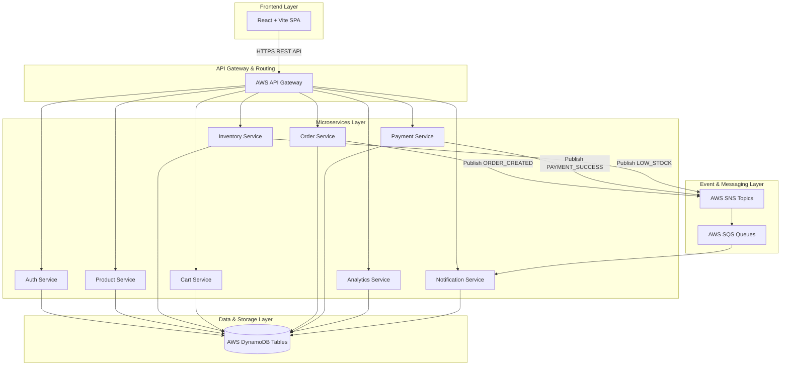
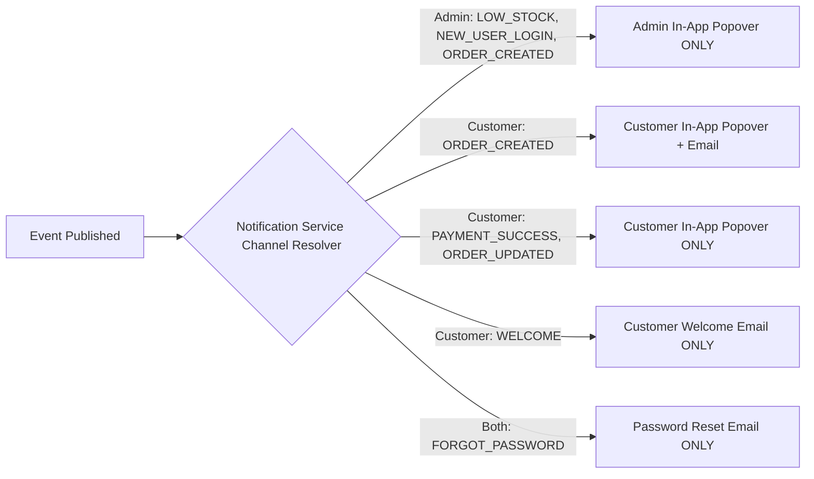

# E-Commerce Microservices Platform

A modern, scalable, serverless microservices e-commerce application built with **Python 3.14 / Django REST Framework**, **React / Vite / TailwindCSS**,  **AWS Lambda**, **AWS DynamoDB**, **AWS SQS/SNS**, and **Terraform**.

---

## Overall System Architecture

---

## Microservices Directory

| Microservice | Base Path | Data Store | Key Responsibilities | README |
| :--- | :--- | :--- | :--- | :--- |
| **Auth Service** | `/api/v1/auth/` | `ram-users` | JWT Auth, Registration, Login, Profile & Users Management | [auth-service/README.md](file:///c:/Users/ramkumar.j/OneDrive%20-%20IDP%20Education%20Ltd/Documents/ecommerce_microservice/auth-service/README.md) |
| **Product Service** | `/api/v1/products/` | `ram-products` | Catalog listing, product details, categories & admin management | [product-service/README.md](file:///c:/Users/ramkumar.j/OneDrive%20-%20IDP%20Education%20Ltd/Documents/ecommerce_microservice/product-service/README.md) |
| **Inventory Service** | `/api/v1/inventory/` | `ram-inventory` | Stock tracking, reservations, low-stock monitoring & alerts | [inventory-service/README.md](file:///c:/Users/ramkumar.j/OneDrive%20-%20IDP%20Education%20Ltd/Documents/ecommerce_microservice/inventory-service/README.md) |
| **Cart Service** | `/api/v1/cart/` | `ram-carts` | Customer cart items, quantity updates & cart clearing | [cart-service/README.md](file:///c:/Users/ramkumar.j/OneDrive%20-%20IDP%20Education%20Ltd/Documents/ecommerce_microservice/cart-service/README.md) |
| **Order Service** | `/api/v1/orders/` | `ram-orders` | Order placement, order status updates & tracking | [order-service/README.md](file:///c:/Users/ramkumar.j/OneDrive%20-%20IDP%20Education%20Ltd/Documents/ecommerce_microservice/order-service/README.md) |
| **Payment Service** | `/api/v1/payments/` | `ram-payments` | Payment processing, transaction history & mock gateway | [payment-service/README.md](file:///c:/Users/ramkumar.j/OneDrive%20-%20IDP%20Education%20Ltd/Documents/ecommerce_microservice/payment-service/README.md) |
| **Analytics Service** | `/api/admin/analytics/` | `ram-analytics` | Admin dashboard metrics, revenue, order stats & user reports | [analytics-service/README.md](file:///c:/Users/ramkumar.j/OneDrive%20-%20IDP%20Education%20Ltd/Documents/ecommerce_microservice/analytics-service/README.md) |
| **Notification Service** | `/api/v1/notifications/` | `ram-notifications` | Multi-channel messaging (In-App popovers & Email) | [notification-service/README.md](file:///c:/Users/ramkumar.j/OneDrive%20-%20IDP%20Education%20Ltd/Documents/ecommerce_microservice/notification-service/README.md) |

---

## Notification Delivery Matrix

### Detailed Matrix Specification

| Audience | Trigger Event | In-App Notification | Email Notification |
| :--- | :--- | :---: | :---: |
| **Admin** | Low Stock Alert (`LOW_STOCK`) | YES | NO |
| **Admin** | New User Login (`NEW_USER_LOGIN`) | YES | NO |
| **Admin** | New Order Placed (`ORDER_CREATED`) | YES | NO |
| **Customer** | Order Placed (`ORDER_CREATED`) | YES | YES |
| **Customer** | Payment Successful (`PAYMENT_SUCCESS`) | YES | NO |
| **Customer** | Order Status Update (`ORDER_UPDATED`) | YES | NO |
| **Customer** | New User Welcome (`WELCOME`) | NO | YES |
| **Both** | Password Reset (`FORGOT_PASSWORD`) | NO | YES |

---

## How the Application Works (End-to-End Flow)

### 1. Customer Shopping & Checkout Flow
1. **User Authentication**: Customer registers or logs in via `/api/v1/auth/login/`. JWT tokens are stored securely in client local storage. Welcome email is triggered upon registration.
2. **Product Browsing & Cart**: Customer views product catalog, selects quantities, and updates shopping cart stored in DynamoDB (`ram-carts`).
3. **Order Placement**: During checkout, the customer submits the order. `OrderService` reserves item stock via `InventoryService` and creates the order record (`ram-orders`).
4. **Payment Confirmation**: Customer completes payment. `PaymentService` processes payment and emits `PAYMENT_SUCCESS`.
5. **Redirection & Confirmation**: Upon successful payment:
   - Cart is automatically cleared.
   - User is redirected to `/orders` page.
   - In-app notification and confirmation email are sent.

### 2. Admin Operations & Management Flow
1. **Role Authorization**: Admin users (`ADMIN` / `ADMINISTRATOR`) log in and access `/admin` dashboard.
2. **Catalog & Stock Management**: Admin updates product prices, stock counts, and inventory levels. Low stock levels (`available_stock < 10`) trigger an in-app alert to the Admin popover.
3. **Order & Payment Audit**: Admin monitors order processing states (Pending $\rightarrow$ Processing $\rightarrow$ Shipped $\rightarrow$ Delivered) and payment histories across all customers.
4. **Analytics Overview**: Admin Dashboard fetches real-time aggregations (total revenue, daily order volumes, active customers) via `AnalyticsService`.

---
