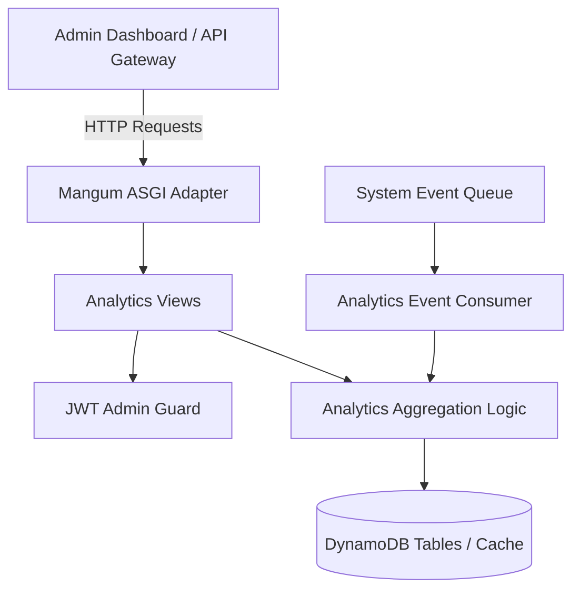

# Analytics Service (`analytics-service`)

## Overview
The **Analytics Service** compiles and aggregates platform metrics for the Admin Dashboard. It summarizes revenue, total orders, active customer metrics, inventory turnover, and product sales statistics across all microservices.

---

## Architecture Diagram

---

## Technical Stack
- **Framework**: Python 3.13 / Django 4.2 / Django REST Framework
- **Database**: AWS DynamoDB (`ram-analytics` / `ANALYTICS_TABLE`)
- **Serverless Adapter**: Mangum (ASGI)

---

## API Inventory

Base URL: `/api/admin/analytics/` or `/api/v1/analytics/`

| Method | Endpoint | Access Level | Description |
| :--- | :--- | :--- | :--- |
| `GET` | `/admin/` or `/` | Admin Only | Get aggregated dashboard metrics (revenue, orders, users) |
| `GET` | `/revenue/` | Admin Only | Get daily / monthly revenue aggregation |
| `GET` | `/products/top/` | Admin Only | Get top-selling products by sales volume |
| `GET` | `/health/` | Public | Health status check |

---

## Environment Variables

| Variable | Description | Default |
| :--- | :--- | :--- |
| `ANALYTICS_TABLE` | DynamoDB Analytics Table Name | `ram-analytics` |
| `AWS_REGION` | AWS Region | `us-east-1` |
| `JWT_SECRET_KEY` | JWT Verification Key | `django-insecure-shared-ecommerce-jwt-secret-key-2026` |
