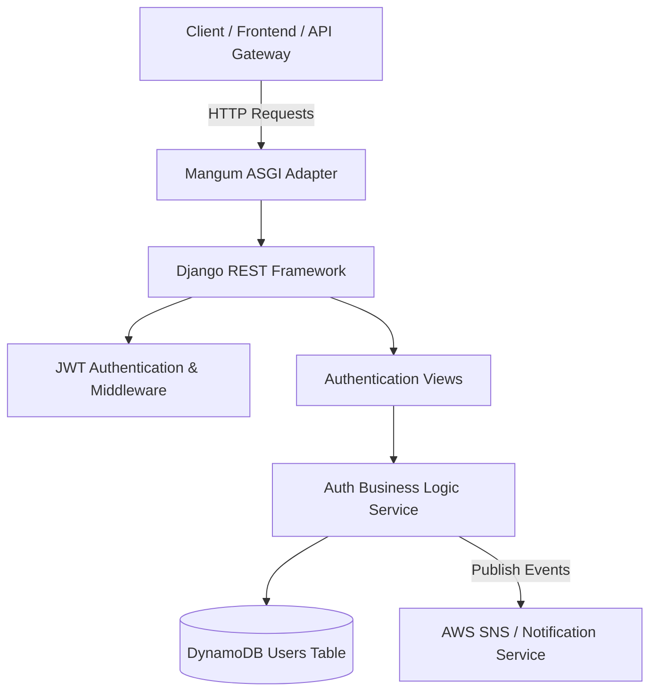

# Auth Service (`auth-service`)

## Overview
The **Auth Service** is a core microservice built with Django REST Framework (DRF) that handles user identity, JWT authentication, user registration, profile management, and role-based access control. It integrates with AWS DynamoDB for persistence and AWS Lambda via Mangum.

---

## Architecture Diagram



---

## Technical Stack
- **Framework**: Python 3.13 / Django 4.2 / Django REST Framework
- **Authentication**: Custom JWT Service (PyJWT, bcrypt)
- **Database**: AWS DynamoDB (`ram-users` / `USER_TABLE`)
- **Serverless Integration**: Mangum (ASGI adapter for AWS Lambda & API Gateway)

---

## Key Features & Endpoints

Base Path: `/api/v1/auth/` or `/api/auth/`

| Method | Endpoint | Access Level | Description |
| :--- | :--- | :--- | :--- |
| `POST` | `/register/` | Public | Register a new customer or admin user |
| `POST` | `/login/` | Public | Authenticate user credentials & receive JWT tokens |
| `POST` | `/logout/` | Authenticated | Logout user session |
| `POST` | `/refresh/` | Public | Generate new access token using refresh token |
| `GET` | `/profile/` | Authenticated | Retrieve current user profile details |
| `PUT` | `/profile/` | Authenticated | Update current user profile details |
| `DELETE` | `/profile/` | Authenticated | Delete current user account |
| `GET` | `/users/` | Admin Only | List all system users |
| `GET` | `/users/<user_id>/` | Admin Only | Retrieve specific user details |
| `GET` | `/health/` | Public | Service health status check |

---

## Environment Variables

| Variable | Description | Default / Example |
| :--- | :--- | :--- |
| `USER_TABLE` | DynamoDB Users table name | `ram-users` |
| `JWT_SECRET_KEY` | Secret key for JWT signing | `django-insecure-shared-ecommerce-jwt-secret-key-2026` |
| `AWS_REGION` | AWS Region for DynamoDB & SNS | `us-east-1` |

---

## Running & Testing

```bash
# Run unit test suite
pytest tests/

# Run locally via Django dev server
python manage.py runserver 8001
```
