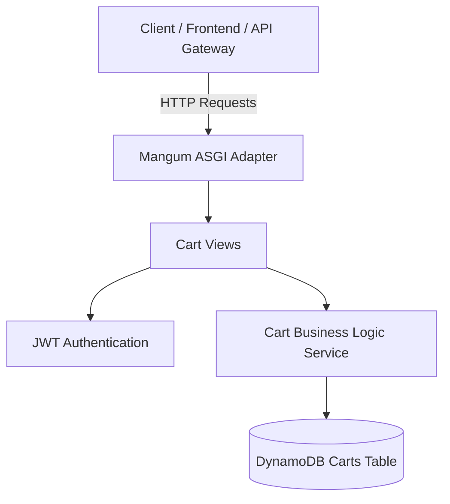

# Cart Service (`cart-service`)

## Overview
The **Cart Service** manages customer shopping carts. It provides endpoints to view cart items, add items, update quantities, remove items, and clear the cart after checkout.

---

## Architecture Diagram

---

## Technical Stack
- **Framework**: Python 3.13 / Django 4.2 / Django REST Framework
- **Database**: AWS DynamoDB (`ram-carts` / `CART_TABLE`)
- **Serverless Adapter**: Mangum (ASGI)

---

## API Inventory

Base URL: `/api/v1/cart/`

| Method | Endpoint | Access Level | Description |
| :--- | :--- | :--- | :--- |
| `GET` | `/api/v1/cart/` | Customer Only | Retrieve active shopping cart |
| `POST` | `/api/v1/cart/items/` | Customer Only | Add product item to shopping cart |
| `PUT` | `/api/v1/cart/items/<product_id>/` | Customer Only | Update item quantity in cart |
| `DELETE` | `/api/v1/cart/items/<product_id>/` | Customer Only | Remove single item from cart |
| `POST` | `/api/v1/cart/clear/` | Customer Only | Clear all items from cart |

---

## Environment Variables

| Variable | Description | Default |
| :--- | :--- | :--- |
| `CART_TABLE` | DynamoDB Carts Table Name | `ram-carts` |
| `AWS_REGION` | AWS Region | `us-east-1` |
| `JWT_SECRET_KEY` | JWT Verification Key | `django-insecure-shared-ecommerce-jwt-secret-key-2026` |
