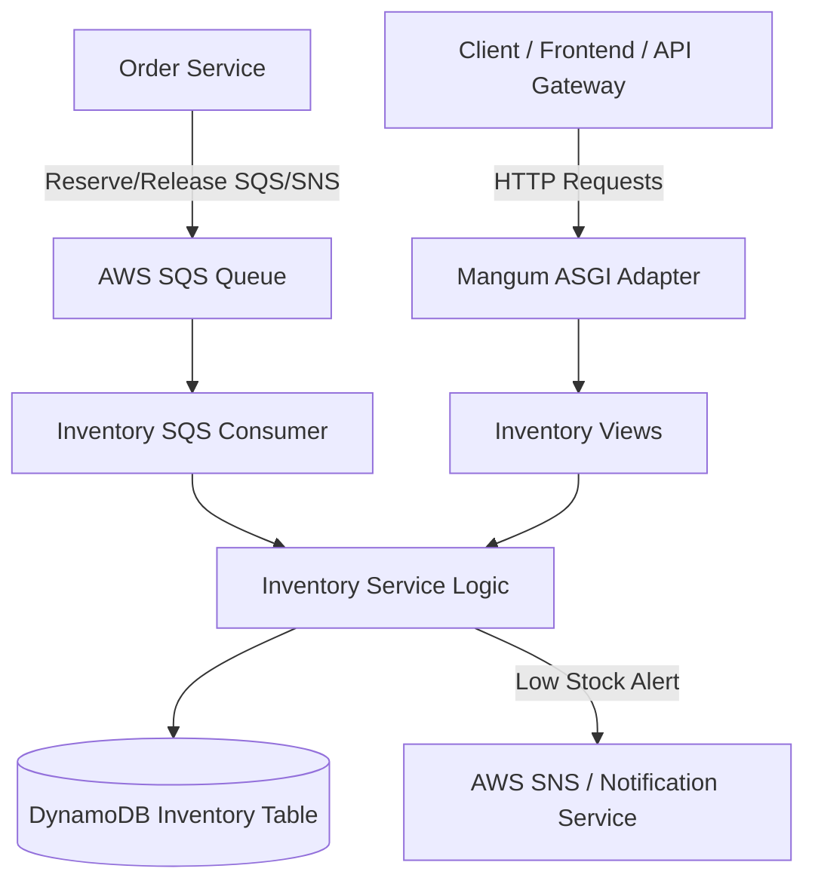

# Inventory Service (`inventory-service`)

## Overview
The **Inventory Service** tracks stock availability, reserved stock, and available stock for products across the platform. It handles stock reservation during checkout, stock releases on cancellation, low stock monitoring, and SNS notification alerts to Admin.

---

## Architecture Diagram

---

## Technical Stack
- **Framework**: Python 3.13 / Django 4.2 / Django REST Framework
- **Database**: AWS DynamoDB (`ram-inventory` / `INVENTORY_TABLE`)
- **Messaging**: AWS SQS / SNS Event Integrations
- **Serverless Adapter**: Mangum (ASGI)

---

## API Inventory

Base URL: `/api/v1/inventory/`

| Method | Endpoint | Access Level | Description |
| :--- | :--- | :--- | :--- |
| `GET` | `/api/v1/inventory/` | Admin Only | List all product inventory records |
| `POST` | `/api/v1/inventory/` | Admin Only | Create initial inventory for a product |
| `GET` | `/api/v1/inventory/<product_id>/` | Authenticated | Retrieve inventory status for a product |
| `PUT` | `/api/v1/inventory/<product_id>/` | Admin Only | Update total stock and reserved stock |
| `PATCH` | `/api/v1/inventory/<product_id>/reserve/` | System / Internal | Reserve stock for checkout flow |
| `PATCH` | `/api/v1/inventory/<product_id>/release/` | System / Internal | Release reserved stock on order cancel |
| `DELETE` | `/api/v1/inventory/<product_id>/` | Admin Only | Delete an inventory record |

---

## Low Stock Notification Flow
When `available_stock` falls below the configured threshold (e.g. `< 10` units), `InventoryService` publishes a `LOW_STOCK` event targeting the Admin role in-app notification center via `NotificationService`.

---

## Environment Variables

| Variable | Description | Default |
| :--- | :--- | :--- |
| `INVENTORY_TABLE` | DynamoDB Inventory Table Name | `ram-inventory` |
| `AWS_REGION` | AWS Region | `us-east-1` |
| `JWT_SECRET_KEY` | JWT Verification Key | `django-insecure-shared-ecommerce-jwt-secret-key-2026` |
