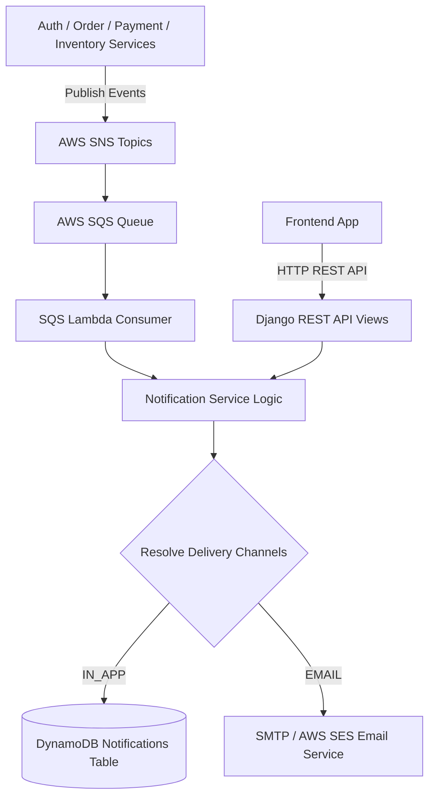

# Notification Service (`notification-service`)

## Overview
The **Notification Service** is a multi-channel messaging service responsible for processing events published across the microservice ecosystem and delivering targeted notifications to Admin and Customer users via **In-App Notifications** (DynamoDB) and **Email Notifications** (SMTP / AWS SES).

---

## Architecture Diagram

---

## Multi-Channel Delivery Matrix Rules

| Recipient Role | Trigger Event | In-App Notification | Email Notification | Delivery Target |
| :--- | :--- | :---: | :---: | :--- |
| **Admin** | Inventory Stock Low (`LOW_STOCK`) | ✅ YES | ❌ NO | Admin In-App Popover |
| **Admin** | New User Login (`NEW_USER_LOGIN`) | ✅ YES | ❌ NO | Admin In-App Popover |
| **Admin** | New Order Placed (`ORDER_CREATED`) | ✅ YES | ❌ NO | Admin In-App Popover |
| **Customer** | Order Placed (`ORDER_CREATED`) | ✅ YES | ✅ YES | Customer In-App Popover + Email Confirmation |
| **Customer** | Payment Successful (`PAYMENT_SUCCESS`) | ✅ YES | ❌ NO | Customer In-App Popover |
| **Customer** | Order Status Update (`ORDER_UPDATED`) | ✅ YES | ❌ NO | Customer In-App Popover |
| **Customer** | Welcome Registration (`WELCOME`) | ❌ NO | ✅ YES | Customer Email |
| **Both** | Password Reset (`FORGOT_PASSWORD`) | ❌ NO | ✅ YES | Recipient Email |

---

## Technical Stack
- **Framework**: Python 3.13 / Django 4.2 / Django REST Framework
- **Database**: AWS DynamoDB (`ram-notifications` / `NOTIFICATION_TABLE`)
- **Messaging**: AWS SQS / SNS Integrations
- **Email Engine**: Django Email / SMTP / AWS SES
- **Serverless Adapter**: Mangum (ASGI)

---

## API Inventory

Base URL: `/api/v1/notifications/`

| Method | Endpoint | Access Level | Description |
| :--- | :--- | :--- | :--- |
| `GET` | `/` | Authenticated | List all notifications for authenticated user |
| `POST` | `/` | Admin / System | Manually trigger a notification payload |
| `PATCH` | `/<id>/read/` | Authenticated | Mark a single notification as READ |
| `PATCH` | `/read-all/` | Authenticated | Mark all user notifications as READ |
| `DELETE` | `/<id>/delete/` | Admin Only | Delete a notification record |
| `GET` | `/health/` | Public | Health status check |

---

## Environment Variables

| Variable | Description | Default |
| :--- | :--- | :--- |
| `NOTIFICATION_TABLE` | DynamoDB Notifications Table Name | `ram-notifications` |
| `SMTP_HOST` | Email SMTP Server Host | `smtp.gmail.com` |
| `SMTP_PORT` | Email SMTP Port | `587` |
| `SMTP_USER` | Email SMTP Username | Required in production |
| `SMTP_PASS` | Email SMTP Password | Required in production |
| `AWS_REGION` | AWS Region | `us-east-1` |
