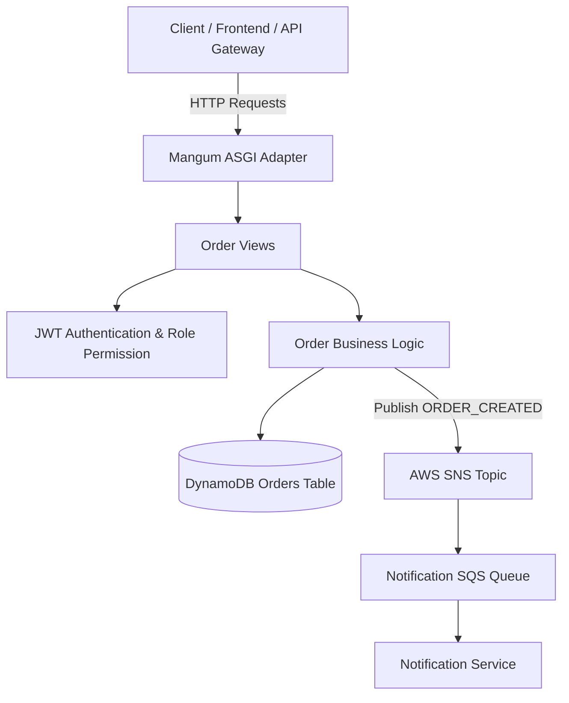

# Order Service (`order-service`)

## Overview
The **Order Service** manages customer order creation, order tracking, order status updates, and order history. It coordinates stock reservations with Inventory Service and triggers SNS notifications for order placement and status updates.

---

## Architecture Diagram

---

## Technical Stack
- **Framework**: Python 3.13 / Django 4.2 / Django REST Framework
- **Database**: AWS DynamoDB (`ram-orders` / `ORDER_TABLE`)
- **Messaging**: AWS SNS / SQS (`ORDER_SNS_TOPIC_ARN`)
- **Serverless Adapter**: Mangum (ASGI)

---

## API Inventory

Base URL: `/api/v1/orders/`

| Method | Endpoint | Access Level | Description |
| :--- | :--- | :--- | :--- |
| `GET` | `/api/v1/orders/` | Customer / Admin | List user orders (Customer) or all orders (Admin) |
| `POST` | `/api/v1/orders/` | Customer | Create a new order from cart items |
| `GET` | `/api/v1/orders/<order_id>/` | Customer / Admin | Retrieve detailed view of a specific order |
| `PATCH` | `/api/v1/orders/<order_id>/status/` | Admin Only | Update order status (Pending, Shipped, Delivered, Cancelled) |
| `DELETE` | `/api/v1/orders/<order_id>/` | Admin Only | Cancel/Delete an order |

---

## Order Placement & Event Flow
1. Customer submits order details at checkout.
2. `OrderService` reserves inventory items via `InventoryService`.
3. Order item details and status (`PENDING`) are persisted in DynamoDB.
4. `ORDER_CREATED` event is published to `ORDER_SNS_TOPIC_ARN`.
5. `NotificationService` consumes event:
   - Stores **In-App Notification** for Customer and Admin popover.
   - Sends **Order Confirmation Email** to Customer.

---

## Environment Variables

| Variable | Description | Default |
| :--- | :--- | :--- |
| `ORDER_TABLE` | DynamoDB Orders Table Name | `ram-orders` |
| `ORDER_SNS_TOPIC_ARN` | AWS SNS Topic ARN for order events | `arn:aws:sns:us-east-1:...:ram-order-topic` |
| `AWS_REGION` | AWS Region | `us-east-1` |
| `JWT_SECRET_KEY` | JWT Verification Key | `django-insecure-shared-ecommerce-jwt-secret-key-2026` |
