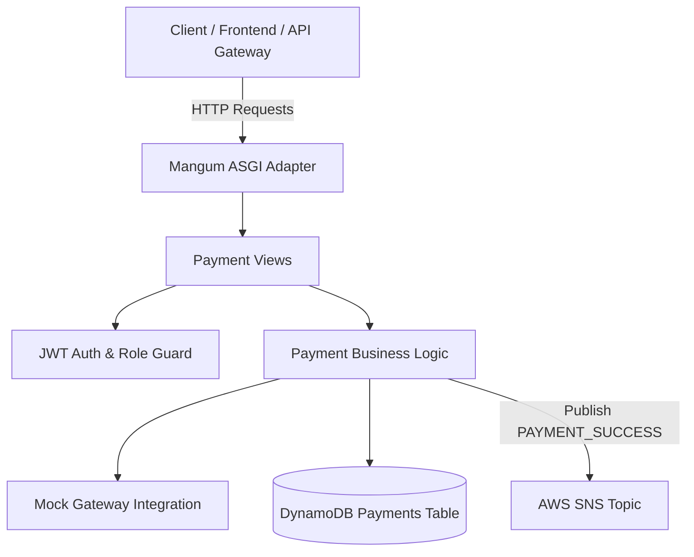

# Payment Service (`payment-service`)

## Overview
The **Payment Service** processes payment transactions for orders. It manages payment initiation, status verification, mock payment gateway integrations, refund workflows, and payment event publishing.

---

## Architecture Diagram

---

## Technical Stack
- **Framework**: Python 3.13 / Django 4.2 / Django REST Framework
- **Database**: AWS DynamoDB (`ram-payments` / `PAYMENT_TABLE`)
- **Messaging**: AWS SNS / SQS (`PAYMENT_SNS_TOPIC_ARN`)
- **Serverless Adapter**: Mangum (ASGI)

---

## API Inventory

Base URL: `/api/v1/payments/`

| Method | Endpoint | Access Level | Description |
| :--- | :--- | :--- | :--- |
| `GET` | `/api/v1/payments/` | Customer / Admin | List user payments (Customer) or all payments (Admin) |
| `POST` | `/api/v1/payments/` | Customer | Initiate payment transaction for an order |
| `GET` | `/api/v1/payments/<payment_id>/` | Authenticated | Retrieve transaction status for a payment |
| `POST` | `/api/v1/payments/<payment_id>/process/` | Customer | Process mock payment gateway authorization |
| `POST` | `/api/v1/payments/<payment_id>/refund/` | Admin Only | Process refund for a completed payment |

---

## Payment Event & Notification Rules
- Upon successful payment processing (`PAYMENT_SUCCESS`), `PaymentService` publishes a payment event to SNS.
- `NotificationService` consumes `PAYMENT_SUCCESS` and records an **In-App Notification** in the Customer's notification center (no email is sent for payment success).

---

## Environment Variables

| Variable | Description | Default |
| :--- | :--- | :--- |
| `PAYMENT_TABLE` | DynamoDB Payments Table Name | `ram-payments` |
| `PAYMENT_SNS_TOPIC_ARN` | AWS SNS Topic ARN for payment events | `arn:aws:sns:us-east-1:...:ram-payment-topic` |
| `AWS_REGION` | AWS Region | `us-east-1` |
| `JWT_SECRET_KEY` | JWT Verification Key | `django-insecure-shared-ecommerce-jwt-secret-key-2026` |
