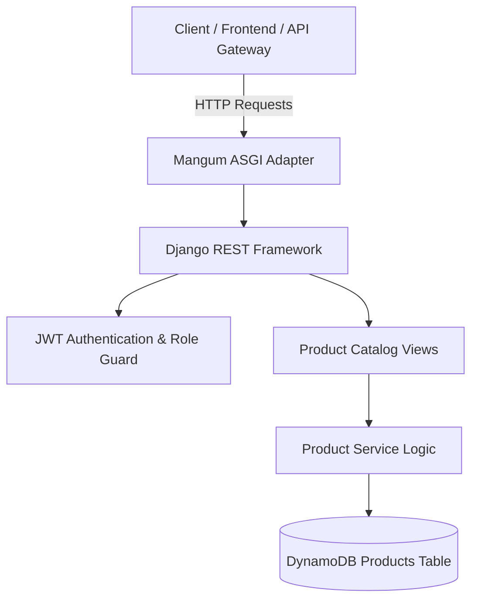

# Product Service (`product-service`)

## Overview
The **Product Service** is a Django REST Framework microservice for managing the product catalog. It handles product creation, retrieval, updates, deletion, category filtering, and inventory status visibility.

---

## Architecture Diagram



---

## Technical Stack
- **Framework**: Python 3.13 / Django 4.2 / Django REST Framework
- **Database**: AWS DynamoDB (`ram-products` / `PRODUCT_TABLE`)
- **Serverless Adapter**: Mangum (ASGI)

---

## API Inventory

Base URL: `/api/v1/products/`

| Method | Endpoint | Access Level | Description |
| :--- | :--- | :--- | :--- |
| `GET` | `/api/v1/products/` | Public | List all available products |
| `POST` | `/api/v1/products/` | Admin Only | Create a new product entry |
| `GET` | `/api/v1/products/<product_id>/` | Public | Retrieve single product details |
| `PUT` | `/api/v1/products/<product_id>/` | Admin Only | Update an existing product |
| `DELETE` | `/api/v1/products/<product_id>/` | Admin Only | Delete a product |
| `GET` | `/api/v1/products/health` | Public | Health check endpoint |

---

## Data Models & Payloads

### Create/Update Product Payload
```json
{
  "name": "Wireless Mechanical Keyboard",
  "description": "RGB Backlit, Bluetooth & 2.4G",
  "price": 89.99,
  "stock": 50,
  "category": "Electronics",
  "image_url": "https://example.com/keyboard.jpg"
}
```

---

## Environment Variables

| Variable | Description | Default |
| :--- | :--- | :--- |
| `PRODUCT_TABLE` | DynamoDB Products Table Name | `ram-products` |
| `AWS_REGION` | AWS Region | `us-east-1` |
| `JWT_SECRET_KEY` | JWT Secret Key for token validation | `django-insecure-shared-ecommerce-jwt-secret-key-2026` |
